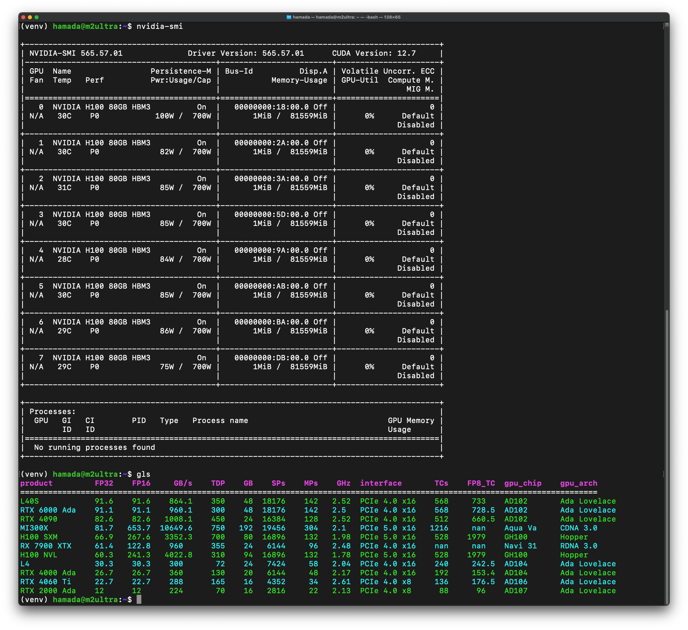

# gls

gls: gpu list

## Install

```
pip install git+https://github.com/thamada/gls.git
```

## Upgrade

```
pip install --upgrade git+https://github.com/thamada/gls.git
```

## Uninstall

```
pip uninstall gls
```

## Available Commands

| commands           | Variations             |
|--------------------|------------------------|
| gls                |                        |
| nvidia-smi         | -a, .a40, .a100, .h100, .h100nvl, .rtx2000ada, .rtx4000ada, .rtx6000ada, .rtx4060ti, .rtx4090, .rtx3090, .gtx1050ti, .l40s, .l4|
| deviceQuery        | .a40, .a100, .h100, .h100nvl, .rtx2000ada, .rtx4000ada, .rtx6000ada, .rtx4060ti, .rtx4090, .rtx3090, .gtx1050ti, .l40s, .l4, .mi300x |
| rocm-smi           | -a                     |
| rocminfo           |                        |


<!--
gls
nvidia-smi
nvidia-smi -a
deviceQuery
rocm-smi
rocminfo
nvidia-smi.a40
nvidia-smi.a100
nvidia-smi.h100
nvidia-smi.h100nvl
nvidia-smi.rtx2000ada
nvidia-smi.rtx4000ada
nvidia-smi.rtx6000ada
nvidia-smi.rtx4060ti
nvidia-smi.rtx4090
nvidia-smi.rtx3090
nvidia-smi.l40s
nvidia-smi.l4
deviceQuery.a40
deviceQuery.a100
deviceQuery.h100
deviceQuery.h100nvl
deviceQuery.rtx2000ada
deviceQuery.rtx4000ada
deviceQuery.rtx6000ada
deviceQuery.rtx4060ti
deviceQuery.rtx4090
deviceQuery.rtx3090
deviceQuery.l40s
deviceQuery.l4
deviceQuery.mi300x
-->

## Screenshot


Enjoy gls!
